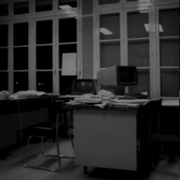
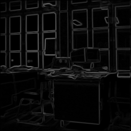
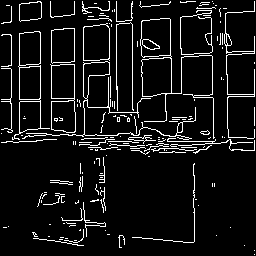

# Rapport de Travaux pratiques

Redigé par Nathan Morel

## Introduction

Ce rapport présente les travaux pratiques réalisés dans le cadre du projet de vision artificielle. Les TP se concentrent sur deux thèmes principaux : la détection de contours et la détection de mouvement. Chaque section détaille les objectifs, la méthodologie, les résultats obtenus.

## Traveau pratique 1: Contour et détection

### Objectif

Le but de ce TP est de comprendre et d'implémenter en langage C, dans l'environnement logiciel EdVision, les premières étapes d'une chaîne d'opérateurs de segmentation en contours. Les étapes incluent :

1. Algorithme de Kirsch à 4 directions
2. Seuillage sur la norme du gradient
3. Affinage des contours

### Étapes à Réaliser

#### 1. Algorithme de Kirsch à 4 directions

**Principe** : Projeter le vecteur gradient selon 4 directions (0°, 90°, 45°, -45°) et choisir la projection la plus proche comme approximation du gradient réel.
Masques de convolution : Utiliser des masques spécifiques pour chaque direction.

#### 2. Seuillage sur la Norme du Gradient

Objectif : Seuiler les pixels en fonction de la norme du gradient pour identifier les points de contour.

#### 3. Affinage des Contours

Principe : Réduire les contours à une épaisseur d'un pixel en ne conservant que les points de contour maximaux localement dans la direction du gradient.
Algorithme à deux voisins : Comparer le pixel courant avec ses deux voisins dans la direction du gradient.
Algorithme à un seul voisin (pour l'optimisation) : Comparer le pixel courant avec un seul voisin dans le passé.

### Travaux à Réaliser

**Fichiers à réaliser :**

1. DetectionContours.c
2. LibKirsh4.c et .h
3. LibSeuillage.c et .h (à reprendre)
4. LibAffinage.c et .h
   **Détails des fichiers :**

- DetectionContours.c : Interface de l'opérateur, gestion des images en entrée et sortie.
- LibKirsh4.c : Calcul du gradient selon l'algorithme de Kirsch.
- LibSeuillage.c : Reprendre le code du semestre précédent.
- LibAffinage.c : Implémenter l'opérateur d'affinage.

### Comparaison des Résultats

La comparaison entre les méthodes optimisée et non optimisée se concentre principalement sur le temps de calcul et l'utilisation de la mémoire. La méthode optimisée, qui regroupe les étapes de calcul du gradient, seuillage et affinage en un seul balayage vidéo, est généralement plus rapide et utilise moins de mémoire, car elle réduit le nombre de lectures et de traitements de l'image. Cependant, elle peut être plus complexe à implémenter et à maintenir. En revanche, la méthode non optimisée, bien que plus simple et flexible, peut être plus lente et consommer plus de mémoire en raison des multiples balayages de l'image et des images intermédiaires nécessaires pour chaque étape.

### Code de Compilation

Voici le script de compilation utilisé pour générer les exécutables :

Les contours détectés sont stockés dans des fichiers d'image et peuvent être visualisés pour évaluer la précision de l'algorithme.

Pour plus de simplicité, nous avons modifié le code de compilation pour qu'il nous genere automatiquement les images de sortie.

```bash
# Créer le répertoire bin s'il n'existe pas
mkdir -p ../bin

# Compiler EdGradientKirsh
gcc -o ../bin/EdGradientKirsh DetectionContours.c EdLibGradientKirsh4SepMasks.c EdLibThinning.c EdLibEdgeUtilities.c EdUtilities.c EdLibThreshold.c


cd ../bin

# Définir les variables d'image
nom_image="Bureau"

image="../image/${nom_image}.pgm"
imageNorm="../ImRes/${nom_image}_norm.pgm"
imagePts="../ImRes/${nom_image}_pts.pgm"

# Exécuter le programme avec les arguments appropriés
./EdGradientKirsh "$image" "$imageNorm" "$imagePts" 20
```

#### Image resultats



Image originale



Image normale



Image points avec comme seuil 10

## Traveau pratique 2: Detection de mouvement

### Objectif

L'objectif de ce TP est de détecter les mouvements dans une séquence d'images en utilisant des algorithmes de différence d'images. La détection de mouvement est une tâche importante dans de nombreuses applications de vision par ordinateur, telles que la surveillance vidéo et la reconnaissance de mouvement.

### Méthodologie

Nous avons utilisé une méthode de soustraction d'images pour détecter les changements entre des images consécutives. Le processus comprend les étapes suivantes :

1. Lecture des images
2. Calcul de la différence entre les images
3. Application d'un seuil pour détecter le mouvement
4. Affichage des résultats

### Code important

#### Lecture des images

La lecture des images est effectuée avec les fonctions Reading_ImageHeader et Reading_ImageData.

```c
if ((ret = Reading_ImageHeader(fichier, &ncol, &nlig, &prof))) {
    fprintf(stderr, "Problem of Reading Image Header \n");
    exit(0);
}
ret = Reading_ImageData(fichier, imCur);
if (!ret) {
    fprintf(stderr, "Problem of Reading \n");
    exit(0);
}
```

#### Detection de mouvement

La détection de mouvement est réalisée avec la fonction MotionDetect.

```c
int MotionDetect(EdIMAGE *imRef, EdIMAGE *imCur, EdIMAGE *imRes, int iTh) {
    EdPOINT *point = NULL; /* current and neighbour points */
    int diff_R, diff_V, diff_B;

    if (crea_POINT(point) == NULL) { /* Creation of Points */
        fprintf(stderr, "Pb of Memory Allocation : EdLibMotionDetect \n");
        return 1;
    }

    for (POINT_Y(point) = 1; POINT_Y(point) < NLIG(imRef) - 1; POINT_Y(point)++) {
        for (POINT_X(point) = 1; POINT_X(point) < NCOL(imRef) - 1; POINT_X(point)++) {
            diff_R = PIXEL_R(imCur, point) - PIXEL_R(imRef, point); // différence entre l'image de référence et l'image courante
            diff_V = PIXEL_V(imCur, point) - PIXEL_V(imRef, point);
            diff_B = PIXEL_B(imCur, point) - PIXEL_B(imRef, point);

            diff_R = (diff_R >= 0) ? diff_R : -diff_R; // valeur absolue
            diff_V = (diff_V >= 0) ? diff_V : -diff_V;
            diff_B = (diff_B >= 0) ? diff_B : -diff_B;

            if (diff_R >= iTh || diff_V >= iTh || diff_B >= iTh) { // si la différence est supérieure au seuil
                // Mouvement détecté
                PIXEL_R(imRes, point) = PIXEL_R(imCur, point); // on met le pixel de l'image courante dans l'image résultante
                PIXEL_V(imRes, point) = PIXEL_V(imCur, point);
                PIXEL_B(imRes, point) = PIXEL_B(imCur, point);
            } else {
                // Pas de mouvement détecté
                PIXEL_R(imRes, point) = 0; // on met le pixel à noir
                PIXEL_V(imRes, point) = 0;
                PIXEL_B(imRes, point) = 0;
            }
        }
    }

    free((void *)point);
    return 0;
}
```

### Résultats

Le script de compilation Compile.sh compile les fichiers nécessaires et génère les exécutables. Les images de sortie sont stockées dans le répertoire ImRes.

```bash

# Créer le répertoire bin s'il n'existe pas
mkdir -p ../bin

# Compiler EdMotionDetect
gcc -o ../bin/EdMotionDetect EdMotionDetect.c EdLibMotionDetect.c EdUtilities.c
echo "EdMotionDetect compiled"

# Compiler EdMotionDetectFond
gcc -o ../bin/EdMotionDetectFond EdMotionDetectFond.c EdLibMotionDetectFond.c EdUtilities.c
echo "EdMotionDetectFond compiled"

# Créer le répertoire ImRes s'il n'existe pas
mkdir -p ../ImRes
echo "ImRes directory created"

cd ../bin

# Exécuter EdMotionDetect
./EdMotionDetect.exe NImCote0000.ppm 30

# Créer le répertoire NImCote dans ImRes s'il n'existe pas
mkdir -p ../ImRes/NImCote

# Déplacer tous les fichiers générés dans ImRes vers le dossier NImCote
mv ../ImRes/* ../ImRes/NImCote/

# Exécuter EdMotionDetectFond
./EdMotionDetectFond.exe NImCote0000.ppm 30 0.01

# Créer le répertoire NImCoteFond dans ImRes s'il n'existe pas
mkdir -p ../ImRes/NImCoteFond

# Déplacer tous les fichiers générés dans ImRes vers le dossier NImCoteFond
mv ../ImRes/* ../ImRes/NImCoteFond/

echo "EdMotionDetect and EdMotionDetectFond executed"

# Deplace le dossier NImCoteFond/NImCote dans ImRes car il a été bouger au dernier deplacement
mv ../ImRes/NImCoteFond/NImCote ../ImRes/
```

Les zones de mouvement détectées sont mises en évidence dans les images résultantes, permettant une analyse visuelle des changements.

#### Image resultats


Image originale


Image mouvement avec un seuil de 30


Image fond avec un seuil de 30 et un alpha de 0.01
