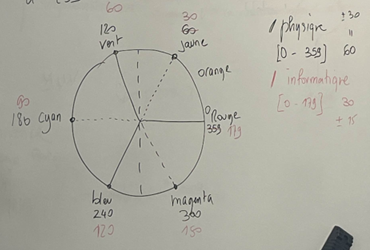
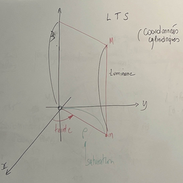
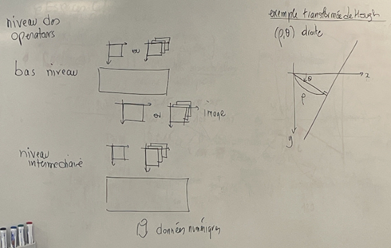
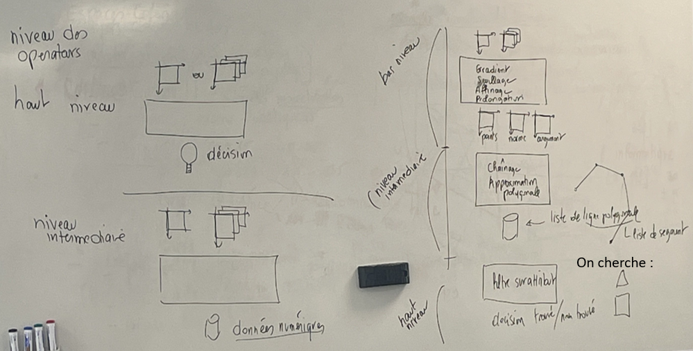
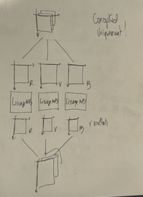
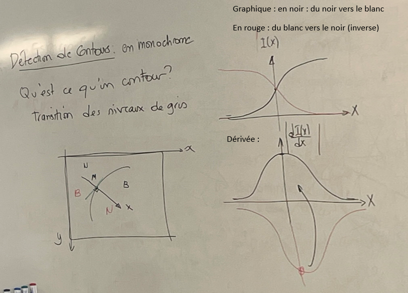
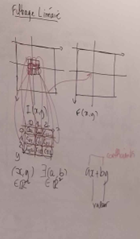
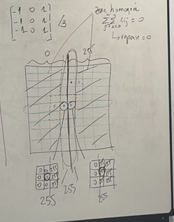

## Espaces colorimétriques
## Extension à la couleur d'un lissage (possible pas au DE)
## Contours (important)
 - Kirsh 4
 - Chainage des contours
## Mouvement

Pas au programme : le gabarit

--------------------------------------------------------------------------------
## Espaces colorimétriques
 - Espaces natifs (R,V,B): c'est nos yeux les capteurs. C'est 3 bandes spectrales identiques.
    On s'en sert pour la segmentation 
    Problème : sensible aux variations d'éclérage pour la "détéction de couleur" (= "teinte")
 - Espace télévisuels (Y,u,v) (Y,Cr,Cb): Y : luminance, Cr : chrominance rouge, Cb : chrominance bleu
    On s'en sert pour la compression
 - Espace perceptif (Luminance, Teinte, Saturation) : c'est notre cerveau. "quasi" invarient aux conditions d'éclérage

 - objets colorés : 
   - Teinte "précise"
   - saturation : minimale (50, 100 à 255) ==> il faut que ça soit saturé 
   - Luminance : aucune (0 à 255)

vert : 60 +- 15 (45 à 75)
bleu : 120 +- 15 (105 à 135)
rouge : 0 +- 15 (0 à 15 et 164 à 179)

 - objets gris : 
 - pas saturé : saturation maximale comprise entre 0 et 50 ou 100 
 - la teinte = ne veut rien dire (0,179) : on ne joue pas sur la teinte 
 - luminance

Saturation max quand on est à 255 

## Extension à la couleur d'un lissage (possible pas au DE)

## Détection de coutours en monocrhone 
Théorie : 
Qu'est ce qu'un contours ? : Transition des niveaux de gris 
A chaque fois qu'on fait un contour on fait une dérivée 

Filtrage linéaire : 

$$
F(x,y) = \sum_{j=0}^{2} \sum_{i=0}^{2} C(i,j) \cdot I(x+i-1,y+j-1)
$$

Réponse du filtre en zone homogène :
zone homogène : 
$$
\forall (i,j) \in [0,2]^2 \quad I(x+i-1,y+j-1)
$$

par linéarité : ax + ay = a(x+y)
$$
F(x,y) = \left[ \sum_{j=0}^{2} \sum_{i=0}^{2} C(i,j) \right] I_0
$$
Avec $\left[ \sum_{j=0}^{2} \sum_{i=0}^{2} C(i,j) \right]$ : somme des coefficients

