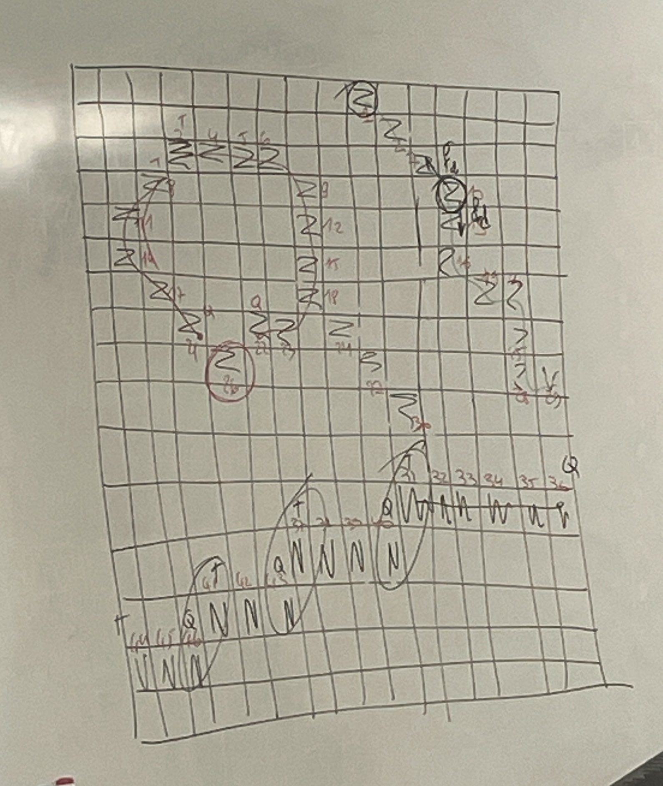

## Espaces colorimétriques
## Extension à la couleur d'un lissage (possible pas au DE)
## Contours (important)
 - Kirsh 4
 - Chainage des contours
## Mouvement

Pas au programme : le gabarit

Code important : tous les Edlib 

--------------------------------------------------------------------------------
## Espaces colorimétriques
 - Espaces natifs (R,V,B): c'est nos yeux les capteurs. C'est 3 bandes spectrales identiques.
    On s'en sert pour la segmentation 
    Problème : sensible aux variations d'éclérage pour la "détéction de couleur" (= "teinte")
 - Espace télévisuels (Y,u,v) (Y,Cr,Cb): Y : luminance, Cr : chrominance rouge, Cb : chrominance bleu
    On s'en sert pour la compression
 - Espace perceptif (Luminance, Teinte, Saturation) : c'est notre cerveau. "quasi" invarient aux conditions d'éclérage

 - objets colorés : 
   - Teinte "précise"
   - saturation : minimale (50, 100 à 255) ==> il faut que ça soit saturé 
   - Luminance : aucune (0 à 255)

vert : 60 +- 15 (45 à 75)
bleu : 120 +- 15 (105 à 135)
rouge : 0 +- 15 (0 à 15 et 164 à 179)

 - objets gris : 
 - pas saturé : saturation maximale comprise entre 0 et 50 ou 100 
 - la teinte = ne veut rien dire (0,179) : on ne joue pas sur la teinte 
 - luminance

Saturation max quand on est à 255 

## Extension à la couleur d'un lissage (possible pas au DE)

## Détection de coutours en monocrhone 
Théorie : 
Qu'est ce qu'un contours ? : Transition des niveaux de gris 
A chaque fois qu'on fait un contour on fait une dérivée 

Filtrage linéaire : 

$$
F(x,y) = \sum_{j=0}^{2} \sum_{i=0}^{2} C(i,j) \cdot I(x+i-1,y+j-1)
$$

Réponse du filtre en zone homogène :
zone homogène : 
$$
\forall (i,j) \in [0,2]^2 \quad I(x+i-1,y+j-1)
$$

par linéarité : ax + ay = a(x+y)
$$
F(x,y) = \left[ \sum_{j=0}^{2} \sum_{i=0}^{2} C(i,j) \right] I_0
$$
Avec $\left[ \sum_{j=0}^{2} \sum_{i=0}^{2} C(i,j) \right]$ : somme des coefficients

Algo detection de contours : 

Le premier de la liste c'est la tête et le dernier c'est la queue

Règle : dans la 1er phase, on ne peut pas attacher pas la queue à la tête. On attache deux points qui sont relier entre eux. On ne peut pas relier deux points qui ne sont pas collés.

Initialisation : l'étiquette courabte etq est initialisée à 1, et le programme se place au point en haut et à gauche de l'image des contours
Examen de la ligne courabte 
    Si le pixel courant est un point de contour faire
    Examen de son passé en 8 connexité : calcul du nombre de queues de contour nq
        Si nq = 0 
            ouvrir un nouveau contour d'étiquette etq
            Inclure ce point 
            incrémenter etq d'une unité
        Si nq = 1 
            accrocher le pixel courant au coutour 
        Si nq = 2 
            accrocher le pixel courant au contour d'indice le plus faible
            accrocher à ce contour le contour d'indice le plus élevé (accrochage queue à queue) 

Pour stocker les coordonnées des points de contours : on utilise l'algo de freemane : 

On a le tableau de freeman : 
| 3 | 2 | 1 |
|---|---|---|
| 4 |   | 0 |
| 5 | 6 | 7 |

## Mouvement 
Méthode de détéction de bas niveau (niveau pixel) : détection de pixels en mouvement 
Contraintes : 
 - Caméra est immobile
 - Pas de variation d'illumination de la scène

Hyotheses : variation de la luminance (R,V,B) = mouvement

Utilisation : première étape d'un système de vidéo surveillance

First order difference picture : 
comparaison : image courante image reference 
$$
\forall n \quad I_n(x,y) - I_{\text{ref}}(x,y)
$$
Avec $I_{\text{n0}}$ : qui peut etre I0 ou I3 
C'est une image dépourvue d'objet de fond 

Algorithme : 
mouvement détécté (ou pixel (x,y)) si et seulement si
$$
|I_{n,r}(x,y) - I_{\text{ref},r}(x,y)| \geq T \quad \text{ou} |I_{n,v}(x,y) - I_{\text{ref},v}(x,y)| \geq T \quad \text{ou} |I_{n,b}(x,y) - I_{\text{ref},b}(x,y)| \geq T
$$

Simple à partir d'un gabarit : 
Constitution : un certain nombre d'images SANS objets mobile 
    Etude des fluctuations de chaque pixel
$$
I{mMin}(x,y) = \min \left\{ I_n(x,y) \mid n \in [0,50] \right\}
$$

$$
I{mMax}(x,y) = \min \left\{ I_n(x,y) \mid n \in [0,50] \right\}
$$
detection dim ~= n > 50
non mouvemet du pixel (x,y) dans l'image n si et seulement si 
$$
I_{\text{mMin}_R}(x,y) \leq I_{n_R}(x,y) \leq I_{\text{mMax}_R}(x,y) \\
\text{et} \\
I_{\text{mMin}_V}(x,y) \leq I_{n_V}(x,y) \leq I_{\text{mMax}_V}(x,y) \\
\text{et} \\
I_{\text{mMin}_B}(x,y) \leq I_{n_B}(x,y) \leq I_{\text{mMax}_B}(x,y)
$$

Resultats : 
Problème : 
    faux positifs : points éparse qui sintillent 
    faux négatifs : "tous" sur le véhicule en mouvement
2 possibilités : 
    statiques : 
        Faux positif : ouverture
        Faux négatif : fermeture
    dynamiques :
        Un point doit être detecté plusieurs fois de suite mouvement pour l'étiquter comme mouvement